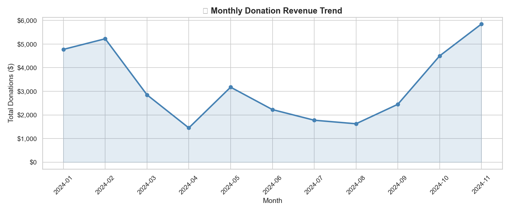
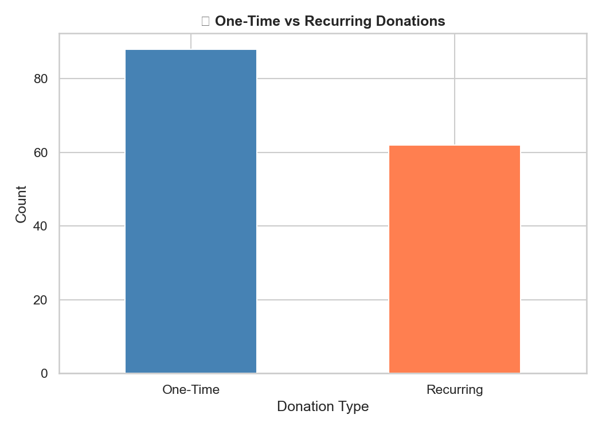
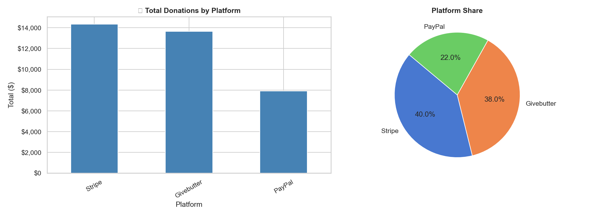
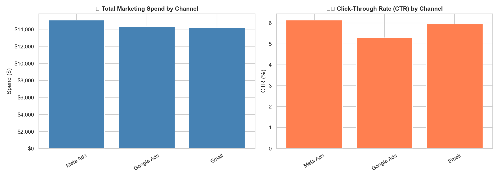
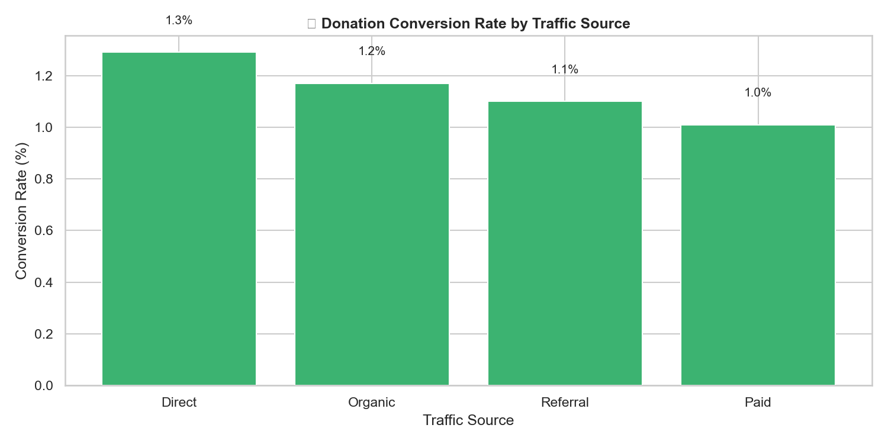

# Impact & Donor Data Dashboard

> Fundraising and donor analytics for a healthcare-AI startup in the medical-tourism space.
> **Capstone Project — ALY6980 Integrated Experiential Learning, Northeastern University (Winter 2026).**

A data-analytics project that consolidates fragmented fundraising data — donations, marketing
spend, web traffic, and program impact — into a single analytics layer, then surfaces the KPIs a
nonprofit-style organization needs to make data-driven outreach decisions: **donor acquisition
cost, ROI per channel, conversion rate, and program impact per dollar.**

The sponsor is a Boston-based startup using AI to connect patients with trusted, cost-effective
treatments in South America, reducing care costs by up to ~70%. The organization relies on donor
contributions to fund its mission, but its fundraising data lived across several disconnected
tools. This project builds the analytics foundation to monitor and improve that fundraising engine.

---

## What's in this repo

| Path | Contents |
|------|----------|
| [`notebooks/donor_eda_analysis.ipynb`](notebooks/donor_eda_analysis.ipynb) | Full exploratory data analysis — data loading, cleaning/missing-value checks, KPI calculations, and the charts below |
| [`data/`](data/) | Four source datasets (sample/synthetic, no real donor PII) |
| [`screenshots/`](screenshots/) | Rendered analysis charts (also reproducible from the notebook) |

### Datasets

| File | Rows | What it captures |
|------|------|------------------|
| `data/donations.csv` | 150 | Individual gifts — amount, platform, campaign, one-time vs. recurring |
| `data/marketing_performance.csv` | 270 | Daily channel performance — impressions, clicks, spend |
| `data/web_analytics.csv` | 120 | Daily web sessions, traffic source, and donations completed |
| `data/impact_metrics.csv` | 6 | Monthly program impact — patients served, cost savings per patient |

---

## Key findings

Numbers below are computed directly from the datasets in this repo.

**Fundraising**
- **$35,900** raised across **150 donations** from **50 unique donors** (avg. gift **$239**), Jan–Nov 2024.
- Gift mix: **88 one-time** vs. **62 recurring** — recurring donors are a meaningful, retainable base.
- Three giving platforms (Givebutter, PayPal, Stripe) across three campaigns
  (*Emergency Surgery Fund, Patient Care Fund, General Support*).

**Marketing efficiency**
- **~$43,600** total ad spend across Email, Google Ads, and Meta Ads.
- Click-through rates are close across channels (**5.3%–6.1%**), with **Meta Ads** highest at 6.1%.

**Web → donation conversion**
- **86,872 sessions** generating **987 completed donations**, broken out by source
  (Direct, Organic, Referral, Paid) to expose where conversion is strongest.

**Program impact**
- **270 patients served** and **~$3.13M in total patient cost savings** over the first 6 months —
  the "impact per fundraising dollar" story that matters to donors and grantmakers.

---

## Visualizations

| | |
|---|---|
|  |  |
|  |  |
|  | |

---

## KPIs the dashboard tracks

- **Donor Acquisition Cost (DAC)** — marketing spend required to win a new donor
- **ROI per channel** — return generated by each campaign relative to its cost
- **Conversion rate** — share of web sessions / campaign reach that complete a donation
- **Donor engagement & retention** — one-time vs. recurring behavior
- **Program impact per dollar** — patients served and cost savings funded

---

## Run the analysis

```bash
# 1. Clone
git clone https://github.com/Bhoomikahp5/Impact-Donor-Dashboard.git
cd Impact-Donor-Dashboard

# 2. (Optional) create a virtual environment
python3 -m venv .venv && source .venv/bin/activate

# 3. Install dependencies
pip install -r requirements.txt

# 4. Launch the notebook
jupyter notebook notebooks/donor_eda_analysis.ipynb
```

> Note: the notebook reads from `data/` using relative paths. Run Jupyter from the **repo root**
> (as above) so the paths resolve.

---

## Tools & methods

- **Python** — pandas (data wrangling, KPI aggregation), matplotlib (visualization)
- **Jupyter Notebook** — reproducible exploratory analysis
- **BI dashboards** — interactive reporting built for the sponsor in Power BI / Looker Studio,
  with charts in this repo reproduced from the same data in Python

---

## Possible extensions

- Donor **lifetime-value (LTV)** modeling and segmentation
- A full **donation conversion funnel** (exposure → visit → page interaction → completion)
- **Predictive donor modeling** to flag likely lapsers and high-potential recurring donors
- A live **Streamlit / Power BI** app wired to the organization's real data sources

---

## Team

Capstone (Team 4), ALY6980 · CRN 20404 · Winter 2026 · Prof. Valerie Atherley
College of Professional Studies, Northeastern University.

Bhoomika Hanbal Puttaswamy · Yuchen He · Yuzhou Zheng · Ting-Yu Lin · Sindhu Reddy Naini

> The data in this repository is sample/synthetic and contains no real donor information.
